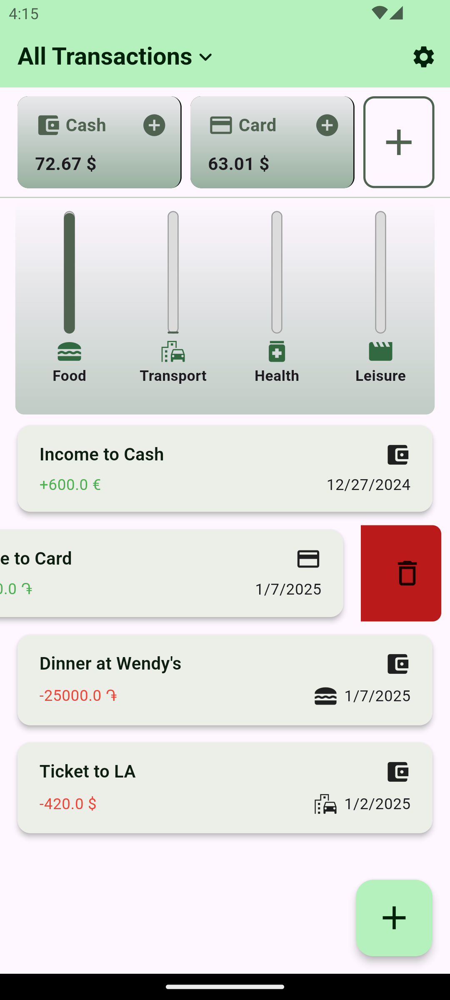

# Expense Tracker Mobile App

## Overview

**Expense Tracker** is a mobile application designed to help users easily manage and track their finances. With a simple and intuitive interface, users can add their incomes and expenses by providing a title, selecting a category, specifying a date, and entering the amount. The app allows users to manage *multiple custom money accounts* (Credit card, Cash, etc.) and *expense categories*. These can be added, removed, or hidden on demand via the settings. The app supports multiple currencies and stays up-to-date with exchange rates through **integrated exchange rate fetching** functionality from the Central Bank of Armenia (CBA). Additionally, the app provides a **chart** to visually compare spending across different categories, helping users understand where their money is going.

## Features

- **Expense Chart**: Displays a chart that helps users visually compare spending across different categories, making it easy to identify the most significant expenses.

- **Transactions List**: A detailed list of all incomes and expenses, including their corresponding accounts, categories, dates, and amounts. Users can *filter transactions, separating incomes and expenses* using a selector.

- **Remove Transactions**: Easily delete transactions by swiping left on the item. *Related finances are automatically adjusted as well*.

- **Customization**: A separate settings screen allows users to *manage their finance accounts and categories*, making it easy to *add new ones, delete them, or hide unnecessary ones*.

- **Multiple Currency Support**: Supports *multiple currencies*, enabling users to select their preferred one. The selected currency is used across the app when adding new expenses or incomes and to display account balances. When changing the selected currency, the app sends an ***API request*** to the Central Bank of Armenia to *fetch the latest exchange rates for supported currencies* and adjusts account balances using the corresponding rates.

- **State Management**: Implements state management using ***Flutter Riverpod*** to ensure consistency and proper notifications for updating exchange rates.

- **Storage**: Uses a ***local SQL database*** to securely and reliably store all relevant data.

## User Interface

- The home screen features a summary chart for a quick visualization of spending habits. Custom-added categories are displayed on the chart, and users can choose which categories to display or hide via settings.
- A list of all transactions is displayed below the chart, enabling easy navigation and management of individual expenses.
- A selector at the top of the screen allows users to filter transactions by type (incomes only, expenses only, or all transactions).
- The settings screen provides options to customize the app, including managing accounts, expense categories, and the selected currency.
- Below the app bar, users' created accounts (excluding hidden ones) are displayed with their balances and icons. A button to add an income to a selected account is also available. The widget is scrollable, with an option at the end to create a new account directly from the main screen.
- Adding transactions is implemented through modal windows—separate ones for expenses and incomes.
- The app is optimized for different screen sizes and supports both light and dark modes, as shown in the attached screenshots.

## Screenshots for the Main Functionality

           

### Responsiveness and Adaptiveness

   

## Getting Started

### How to Run

1. Clone the repository:

   ```bash
   git clone https://github.com/mutafyan/expense_tracker.git
   ```

2. Navigate to the project directory:

   ```bash
   cd expense_tracker
   ```

3. Install dependencies:

    ```bash
    flutter pub get
    ```

4. Generate a Flutter project with the given source code:

    ```bash
    flutter create .
    ```

5. Run the app on an emulator or physical device:

   ```bash
   flutter run
   ```

### Usage

- To add an expense, tap the **(+)** button at the bottom of the screen, fill in the required details, and click save.
- To add an income, tap the **(+)** button in the desired account's related widget, enter the amount in the modal window that opens, and click save.
- To delete a transaction, swipe left on the item you wish to remove.
- To add, delete, or hide categories and accounts, or to change the selected currency, use the settings screen accessible from the top-right corner.
- View the summary chart at the top of the home screen to analyze your spending patterns.

## License

This project is licensed under the MIT License - see the LICENSE file for details.

## Contributions

Contributions are welcome! Feel free to open an issue or submit a pull request.
