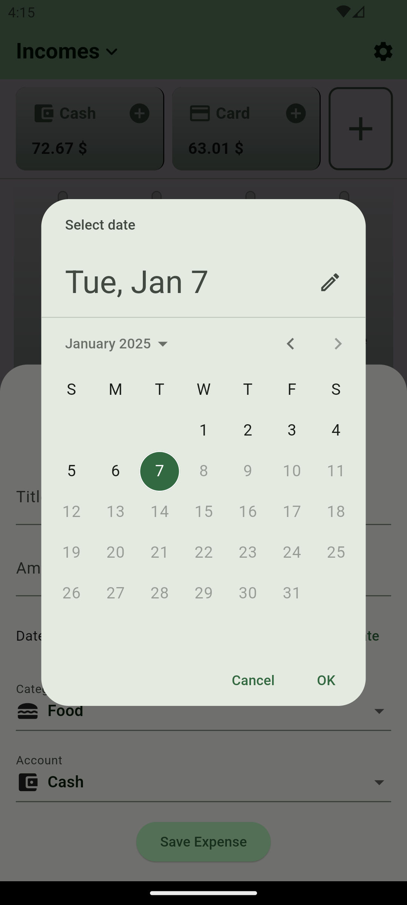
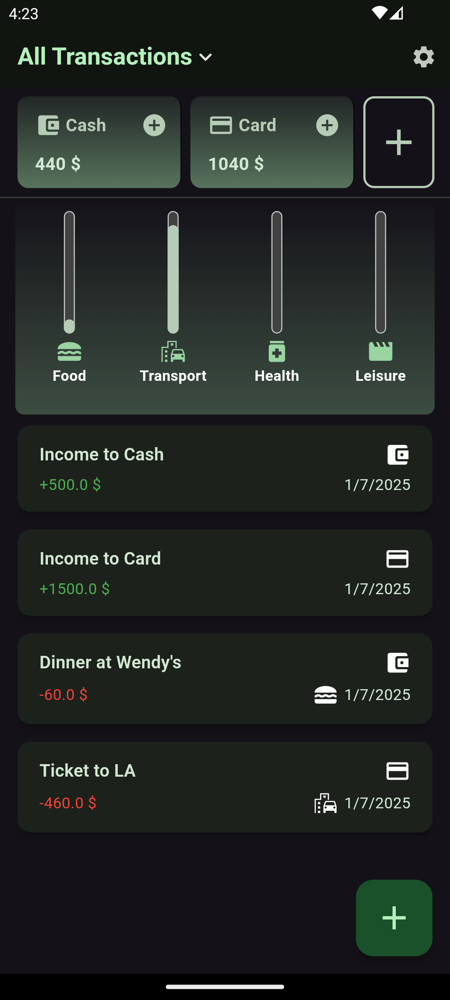
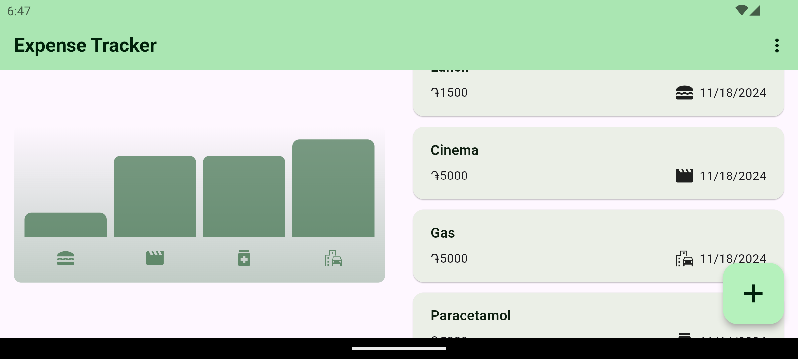

# Expense Tracker Mobile App

## Overview

Expense Tracker is a mobile application designed to help users easily manage and track their expenses. With a simple and intuitive interface, users can add expenses by providing a title, selecting a category, specifying a date, and entering the amount spent. The app also provides a chart to visually compare spending across different categories, making it easier for users to understand where their money is going.

## Features

- **Add Expenses**: Users can add an expense by providing the following details:
  - Title (e.g., "Lunch", "Taxi")
  - Category (e.g., Transportation, Food, Health)
  - Expense Date
  - Amount Spent

- **Expense Chart**: The app displays a chart that helps users visually compare spending across different categories. This makes it easy to see which areas are costing the most.

- **Expense List**: A detailed list of all expenses with their corresponding categories, dates, and amounts is available. Each item in the list is clearly displayed for easy reference.

- **Remove Expenses**: Users can easily delete an expense by swiping left on the item they wish to remove.

## User Interface

- The home screen features a summary chart for quick visualization of your spending habits.
- A list of all expenses is displayed below the chart, allowing for easy navigation and management of individual expenses.
- Also the app is optimized for different screen sizes and both light and dark mode, as you could see on the screenshots attached

## Screenshots for the main functionality

   

### Responsiveness and Adaptiveness

   

## Getting Started

## How to Run

1. Clone the repository:

   ```bash
   git clone https://github.com/mutafyan/expense_tracker.git
   ```

2. Navigate to the project directory:

   ```bash
   cd expense_tracker
   ```

3. Install dependencies:

    ```bash
    flutter pub get
    ```

4. Generate a flutter project with given source code:

    ```bash
    flutter create .
    ```

5. Run the app on an emulator or physical device:

   ```bash
   flutter run
    ```

## Usage

- To add an expense, tap the **Add (+)** button at the bottom of the screen, fill in the required details, and click save.
- To delete an expense, simply swipe left on the item you wish to remove.
- View the summary chart at the top of the home screen to understand your spending patterns.

## License

This project is licensed under the MIT License - see the LICENSE file for details.

## Contributions

Contributions are welcome! Feel free to open an issue or submit a pull request.
